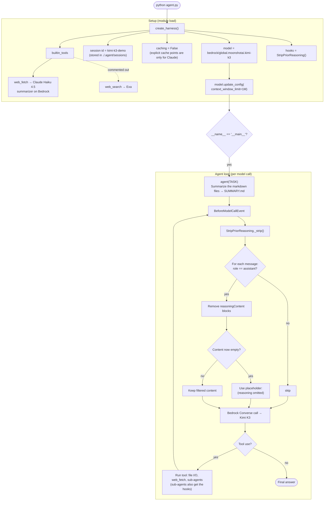

# strands-harness-kimi-k3

A minimal example of [Strands harness](https://strandsagents.com/blog/introducing-strands-harness/),
the open-source agent runtime from the Strands Agents team at AWS, running on
[Kimi K3](https://aws.amazon.com/blogs/machine-learning/introducing-kimi-k3-on-amazon-bedrock/),
Moonshot AI's 1M-token model in Amazon Bedrock.

Companion code for the blog post *Building agents with Strands harness and Kimi K3 in Amazon Bedrock*.

## Why Kimi K3

Frontier-adjacent quality at a lower price, with its strongest results on coding.

| | Kimi K3 | GPT-5.6 Sol | Claude Opus 5 | Claude Fable 5 |
|---|---|---|---|---|
| Price per 1M tokens (input / output) | $3 / $15 | $4 / $20 | $5 / $25 | $10 / $50 |
| Artificial Analysis Intelligence Index | 60 | 61 | 63 | 62 |
| LMArena Frontend Code Arena (Elo) | **1,679 (#1)** | 1,618 | — | 1,631 |
| Vals Index | 57.8% | 63.7% | 67.2% | 66.0% |

- **Cost:** 40% less per token than Claude Opus 5 and 70% less than Claude Fable 5. Cached input is $0.30 per 1M tokens, and Bedrock's Flex tier halves the price to $1.50 / $7.50 for jobs that can tolerate slower responses.
- **Quality:** within 1-3 points of all three on Artificial Analysis's overall index, and #1 on LMArena's Frontend Code Arena.
- **Where it trails:** 6-9 points behind on broader knowledge-work evaluations such as the Vals Index. A strong default for coding and long-context agent work; test it against your own tasks before swapping it in everywhere.

*Kimi K3's price is Bedrock's global cross-Region Standard tier; other prices are vendor API list prices (GPT-5.6 Sol's is promotional through November 21, 2026). Benchmarks are from Artificial Analysis (v4.1.1), LMArena, and Vals AI as of September 2026, compiled by [Codersera](https://codersera.com/blog/kimi-k3-benchmarks-comparison-2026/). See the [Bedrock pricing page](https://aws.amazon.com/bedrock/pricing/) for current rates.*

## Prerequisites

- An AWS account with access to Amazon Bedrock
- IAM permissions for `bedrock:InvokeModel` and `bedrock:InvokeModelWithResponseStream` on the Kimi K3 inference profile and model
- AWS credentials configured (`aws configure`, IAM Identity Center, or an instance role)
- Python 3.10 or later

## Install

```bash
python -m venv .venv && source .venv/bin/activate
pip install -r requirements.txt
```

The harness uses your standard AWS configuration (`aws configure`, IAM Identity Center, an instance role, or the usual `AWS_*` env vars). To pin a Region for a single run without changing your default profile: `AWS_REGION=us-west-2 python agent.py`.

## Run

Put a few markdown files in the directory (or run from a project's `docs/` folder), then:

```bash
python agent.py
```

The agent reads each markdown file and writes a combined overview to `SUMMARY.md`.

`agent.py` selects the model with `model="bedrock/global.moonshotai.kimi-k3"`. The `bedrock/` prefix picks the Bedrock provider and the rest is the inference profile ID.

## How `agent.py` works



## Resume a session

`agent.py` uses a fixed `session={"id": "kimi-k3-demo"}`, so running it again continues the same conversation. Change the ID to start fresh. Sessions are stored under `./.agent/sessions`.

## Web search

Kimi K3 has no native web search in Bedrock, so the harness disables that tool and logs a warning at startup. To search through Exa (third party, keyless free tier; set `EXA_API_KEY` to lift the rate limit), uncomment the `web_search` line in `agent.py`'s `builtin_tools`.

## Web fetch summarizer

`web_fetch` is on by default and normally delegates page summarization to a small model in the same provider family. The harness can't map Kimi K3 to a known family, so left unconfigured it would fall back to summarizing fetched pages with Kimi K3 itself -- a 1M-context model doing a job a small model handles fine, at Kimi K3's token price. `agent.py` pins `builtin_tools={"web_fetch": {"model": "bedrock/global.anthropic.claude-haiku-4-5-20251001-v1:0"}}` to use Claude Haiku on Bedrock instead, under the same AWS credentials.

## Kimi K3-specific settings in `agent.py`

`agent.py` includes three small adjustments for running Kimi K3 through the harness's Bedrock provider:

- **Strip reasoning from earlier turns.** The harness's Bedrock provider uses the Converse API. The [Kimi K3 model card](https://docs.aws.amazon.com/bedrock/latest/userguide/model-card-moonshot-ai-kimi-k3.html) notes that Converse returns an `InternalServerException` when reasoning content from earlier turns is included in a multi-turn request, and names Strands Agents' default configuration as affected. Strands strips prior-turn reasoning automatically only for DeepSeek models, so the `StripPriorReasoning` hook removes it before every model call. The harness forwards hooks to sub-agents, so delegated subtasks are covered too.
- **Set the real context window.** Strands doesn't know Kimi K3's context window yet and assumes 200K tokens, which would make the harness compact context at roughly 170K. `agent.py` sets `context_window_limit=1_000_000` on the model.
- **Turn off client-side cache points.** Strands only adds explicit cache points for Claude models on Bedrock, so `caching=True` does nothing for Kimi K3 except log a warning on every request. `agent.py` passes `caching=False`. Bedrock's automatic prompt caching for Kimi K3 still applies.

## Kimi K3 inference profiles

| Profile | ID | Coverage |
|---|---|---|
| US | `us.moonshotai.kimi-k3` | US Regions and Canada (Central) |
| Global | `global.moonshotai.kimi-k3` | US, Canada, Europe, Asia Pacific, and more; about 10% cheaper |

Source: [Kimi K3 model card](https://docs.aws.amazon.com/bedrock/latest/userguide/model-card-moonshot-ai-kimi-k3.html)

## Clean up

Nothing to tear down: Bedrock bills per token. Delete the local `.agent/` folder to remove saved sessions.

## Links

- [Introducing Strands harness](https://strandsagents.com/blog/introducing-strands-harness/)
- [Strands harness quickstart](https://strandsagents.com/docs/user-guide/harness/quickstart/)
- [Strands Harness SDK on GitHub](https://github.com/strands-agents/harness-sdk)
- [Introducing Kimi K3 on Amazon Bedrock](https://aws.amazon.com/blogs/machine-learning/introducing-kimi-k3-on-amazon-bedrock/)
- [Kimi K3 model card](https://docs.aws.amazon.com/bedrock/latest/userguide/model-card-moonshot-ai-kimi-k3.html)

## License

Apache License 2.0. See [LICENSE](LICENSE).
